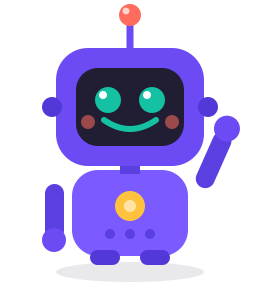

<!-- _class: cover -->
<!-- _paginate: false -->

<div class="kicker">Модуль 3 · Урок 3.2</div>

# Игра принимает <mark>решения</mark>

### Научим Бипа выбирать: пройти уровень по очкам или поставить оценку по баллам.



---

## Это снова я, Бип! 🤖

<div class="bubble"><span>Сравнивать числа я уже умею. Сегодня научи меня <strong>самому решать</strong>, что делать дальше: хватило очков — «Победа!», не хватило — «Попробуй ещё».</span></div>

### Эту супер-силу даёт команда `if`.

---

<!-- _class: center -->

# Теперь программа сама решает, <mark>что делать дальше</mark>.

### Хватило очков — «Победа!». Не хватило — «Попробуй ещё». Это умеет `if`.

---

## Вспомним прошлый урок

- `bool` хранит `true` или `false`
- Сравнения: `>`, `<`, `>=`, `<=`, `==`, `!=`
- Сравнение даёт ответ «да/нет»

<div class="bubble"><span>Раньше я просто показывал тебе 0 или 1. Сегодня по этому ответу я буду <strong>выбирать</strong>, что вывести на экран.</span></div>

---

## Что мы сегодня сделаем

<div class="flow">

<div class="step">
<span class="ico">❓</span>

**if** <small>если правда</small>

</div>

<div class="step">
<span class="ico">🔀</span>

**else** <small>а иначе</small>

</div>

<div class="step">
<span class="ico">🪜</span>

**else if** <small>много веток</small>

</div>

</div>

1. Команда `if` — «если…»
2. Круглые и фигурные скобки
3. `else` — «а иначе…», `else if` — много веток
4. **Практика в классе** — ветвления в игре
5. **Домашнее задание**

---

## Команда `if` — «если»

### Если условие — правда, выполнить код в фигурных скобках.

```cpp
int score = 90;
if (score >= 50) {
    std::cout << "Уровень пройден!";
}
```

<div class="bubble"><span>Очков 90, «90 больше или равно 50?» — правда, поэтому я напечатаю «Уровень пройден!». Будь меньше 50 — я бы промолчал.</span></div>

---

## Из чего состоит `if`

```cpp
if (условие) {
    // что сделать, если правда
}
```

- После `if` — **условие в круглых скобках** `( )`
- Дальше — **фигурные скобки** `{ }` с командами
- Внутри обычно сравнение из прошлого урока

<div class="tip">После строки <strong>if (...)</strong> точку с запятой не ставим — сразу за ней идут фигурные скобки.</div>

---

## `else` — «а иначе»

### `if` решает, что делать, когда правда. `else` — когда ложь.

```cpp
int hp = 0;
if (hp > 0) {
    std::cout << "Герой жив";
} else {
    std::cout << "Игра окончена";
}
```

<div class="fact">Здоровья 0, «0 больше 0?» — ложь, поэтому выполнится ветка else: «Игра окончена».</div>

---

## Развилка на дороге 🛣️

### `if/else` — это развилка: программа идёт по одной из двух дорог.

<div class="cols">

<div>

**Условие — правда**
идём в `if { }`

</div>

<div>

**Условие — ложь**
идём в `else { }`

</div>

</div>

<div class="bubble"><span>Я всегда выбираю <strong>ровно одну</strong> дорогу — никогда обе сразу. Как на настоящей развилке: налево или направо.</span></div>

---

## `else if` — много вариантов

### Когда вариантов больше двух, добавляем `else if`.

```cpp
int score = 75;
if (score >= 90) {
    std::cout << "Оценка 5";
} else if (score >= 70) {
    std::cout << "Оценка 4";
} else {
    std::cout << "Учись ещё";
}
```

---

## Как читается `else if`

### Программа проверяет условия **сверху вниз** и выбирает первое подходящее.

1. `score >= 90`? — нет (75 < 90)
2. `score >= 70`? — да! → «Оценка 4»
3. остальное не проверяется

<div class="tip">Как только я нашёл подходящую ветку — дальше я уже не смотрю и сразу иду по ней.</div>

---

## Разбор примера · вход по возрасту

```cpp
int age = 12;
if (age >= 12) {
    std::cout << "Можно играть!";
} else {
    std::cout << "Игра 12+";
}
```

На экране: <span class="out">Можно играть!</span>

<div class="fact">Возраст 12, «12 больше или равно 12?» — правда. Знак &gt;= включает само число 12, поэтому выполнится первая ветка.</div>

---

## Частые ошибки

<div class="grid">

<div class="card">
<span class="ico">⚠️</span>

### `=` вместо `==`
`if (x = 5)` — это присваивание! Сравнение — `if (x == 5)`.

</div>

<div class="card">
<span class="ico">⚠️</span>

### `;` сразу после `if`
`if (x > 0);` — условие ни на что не влияет. Точку с запятой убрать.

</div>

<div class="card">
<span class="ico">⚠️</span>

### Забыли `{ }`
Без скобок в `if` попадёт только одна строка. Лучше всегда ставить `{ }`.

</div>

</div>

---

## Проверь себя · что я выведу? 🧠

```cpp
int coins = 40;
if (coins >= 100) {
    std::cout << "Купил меч";
} else {
    std::cout << "Мало монет";
}
```

### Подумай 10 секунд…

<div class="bubble"><span>Монет 40, «40 больше или равно 100?» — ложь. Выполню else и напечатаю <span class="out">Мало монет</span>.</span></div>

---

## Проверь себя · ещё разок 🧠

```cpp
int level = 3;
if (level == 1) {
    std::cout << "Старт";
} else if (level == 3) {
    std::cout << "Босс!";
}
```

### Подумай 10 секунд…

<div class="bubble"><span>Уровень 3. Первое условие ложно, второе — «3 равно 3?» — правда. Выведу <span class="out">Босс!</span>.</span></div>

---

<!-- _class: section -->

<div class="bignum">ПРАКТИКА В КЛАССЕ</div>

# Ветвления в игре 🎮

### Пишем прямо сейчас: программа сама решает, что показать игроку.


---

<!-- _class: task -->

# Задача 1 · Пройти уровень 🏁

### Уровень пройден при **50 очках и больше**. Введи 30, потом 80:

```cpp
int score;
std::cin >> score;
if (score >= 50) {
    std::cout << "Уровень пройден!";
} else {
    std::cout << "Попробуй ещё";
}
```

---

<!-- _class: task -->

# Задача 2 · Оценка по баллам 📊

### Спроси баллы (0–100) и поставь оценку. Проверь три ветки — 90, 70, 40:

```cpp
if (points >= 85) {
    std::cout << "Отлично!";
} else if (points >= 60) {
    std::cout << "Нормально";
} else {
    std::cout << "Подтянись";
}
```

---

<!-- _class: task -->

# Задача 3 · Чётное или нечётное 🔢

### Спроси число. Остаток `n % 2` равен 0 — число чётное:

```cpp
int n;
std::cin >> n;
if (n % 2 == 0) {
    std::cout << "Чётное";
} else {
    std::cout << "Нечётное";
}
```

---

<!-- _class: task -->

# Задача 4 · Светофор в гонке 🚦 <span class="pill">★ со звёздочкой</span>

В гоночной игре цвет светофора задаётся числом: `1` — красный, `2` — жёлтый, `3` — зелёный.

1. Спроси число у игрока
2. Через `if / else if / else` выведи название цвета
3. На «лишнее» число ответь «Нет такого сигнала»

`Подсказка: три ветки else if и финальный else`

---

## Что мы сегодня научились 💪

<div class="bubble"><span>Теперь я не просто считаю — я <strong>принимаю решения</strong> и выбираю одну из дорог. Совсем как настоящая игра!</span></div>

- `if (условие) { }` — выполнить код, если правда
- `else { }` — что делать, если условие ложно
- `else if` — выбрать один из нескольких вариантов
- Условия проверяются сверху вниз
- В `if` сравниваем через `==`, а не `=`

---

<!-- _class: dark -->
<!-- _paginate: false -->

# Домашнее задание 🏠

### 1. Реши **рабочий лист 3.2** — уровни, оценки и чётность.
### 2. Загляни в **шпаргалку 3.2** — `if`, `else`, `else if` под рукой.

<br>

**Дальше:** урок 3.3 — соединим условия через `&&`, `||`, `!` и соберём **викторину**.
</content>
